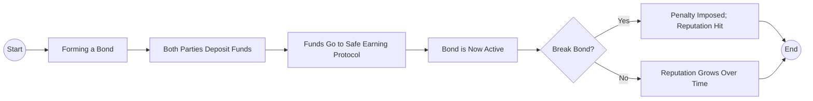

# Trust Protocol

Welcome to the Trust Protocol, a new way to establish on-chain credibility and reduce fraud in decentralized environments. We do this by introducing on-chain trust bonds that let you literally put your money where your mouth is, proving trustworthiness while earning yield on your bond funds.

## Problem Statement

Trust is a fundamental component of human interaction. But **how do you ensure trust and credibility on-chain?**

In Web3, the freedom to create multiple identities anonymously can make it hard to tell who is truly trustworthy. Bad actors can easily pose as credible users or even create fake identities to scam others, leading to rug pulls, phishing attacks, and a general lack of trust. Honest users often pay the price, with no reliable way to distinguish legitimate participants from malicious ones in a decentralized environment. As a result, the entire community suffers from mistrust, reduced collaboration, and missed opportunities.

## Solution

Our protocol introduces **on-chain trust bonds**. In this system, two parties each deposit equal funds into a shared pool (the “cookie jar”) to form a bond of mutual trust. At any time, either party can choose to break the bond, but doing so incurs both financial(5% of the total amount goes to the protocol treasury) and reputational penalties(their reputation score decreases).

## Core Mechanics

### Equal Deposit

Both parties deposit the same amount of funds into the trust bond - smart contract. These funds immediately go into a yield-earning protocol (like a savings or lending platform), so your money works for you while trust is established.

### Active Bond

As soon as the bond is formed, both users start accruing yield in equal shares. The longer they keep the bond intact, the more interest they earn—and the more their on-chain reputation benefits.

### Breaking the Bond

At any time, either party can choose to break the bond. Doing so incurs two penalties:

- **Financial Penalty**: 5% of the total bond amount goes to the protocol treasury.
- **Reputation Penalty**: The breaker's reputation score decreases, visible to all on-chain.

### User Journey (Example)

1. **Alice and Bob decide to form a trust bond, each depositing 100 USDC.**
2. **Bond is Active**: Their combined 200 USDC is staked in a lending protocol, earning yield.
3. **Time Passes**: After a few months, both have accumulated interest and improved reputations by not breaking the bond.
4. **Decision Point**: If Alice breaks the bond unilaterally, she will pay the 5% penalty from the entire bond pool and see her reputation decrease. Meanwhile, Bob’s reputation remains intact.

## Reputation Points

Reputation Points lie at the heart of our protocol, reflecting how trustworthy each participant is based on their on-chain behavior. Here’s how they’re calculated and why they matter:

1.  **Initial Reputation**

    - Each user starts with a base reputation score of **0**.

2.  **Formation & Maintenance of Bonds**

    - Every time a user successfully creates a trust bond and keeps it active, **they gain positive reputation**.
    - A larger total deposit (i.e., more “skin in the game”) will generally yield higher reputation rewards.

3.  **Bond Duration**

    - The **longer** a bond remains unbroken, the more it contributes to a user’s reputation. This rewards consistent and ongoing trustworthiness.

4.  **Breaking a Bond**

    - If a user unilaterally breaks a bond, they incur a **reputation penalty** in addition to 5% of total amount going to the protocol treasury.
    - This reduction is recorded on-chain, signaling to others that the user has broken trust in the past.

5.  **On-Chain Visibility**

    - Reputation points are visible and verifiable on-chain, allowing other platforms to easily query or reference these scores.
    - Protocols can then decide whether to offer users certain perks (e.g., higher borrowing limits, exclusive access) or to restrict access based on a minimum trust threshold.

6.  **Sybil Resistance**
    - By using unique identity checks (e.g.Gitcoin Passport) and identities like ENS, each user can build only one reputation profile, preventing people from creating multiple accounts to boost their scores artificially.

Overall, Reputation Points incentivize honest behavior and discourage malicious actions within the protocol, driving a healthier, more secure Web3 ecosystem.

## Use Cases & Benefits

### For Users

- **Proof of Trustworthiness**

  - Users who maintain active trust bonds can showcase a verifiable track record of honest behavior, which may unlock additional opportunities or perks in various dApps.

- **Earn Yield on amount deposited in Trust Bonds**

  - Rather than letting their deposits sit idle, users can earn passive income through staking or lending protocols while simultaneously building their on-chain reputation.

- **Protection Against Fraud**

  - The penalty and reputation mechanisms deter bad actors from breaking agreements, making the ecosystem safer for all honest participants.

- **Interoperable Reputation**
  - Because reputation points are stored on-chain, users can carry their credibility across multiple platforms—no need to rebuild trust from scratch with every new service.

### For Other Protocols

- **Automated Trust Layer**

  - Projects can tap into our trust bonds data to quickly assess the reliability of potential participants or users, reducing the risk of scams or default.

- **Reduced Onboarding Friction**

  - Rather than building a reputation system from scratch, protocols can leverage our on-chain scores to create entry barriers, tiered rewards, or premium features for trustworthy users.

- **Enhanced Security & Credibility**

  - By integrating with a proven trust mechanism, other protocols can ensure a higher standard of user conduct, boosting overall community confidence.

- **Synergy Across the Ecosystem**
  - The broader Web3 space benefits when multiple platforms share and trust a common reputation framework, fostering safer interactions and more transparent collaborations.

## Examples

Below are some short and sweet scenarios showcasing how trust bonds add value across various Web3 use cases:

#### DeFi Lending & Borrowing

- Trusted users enjoy better loan terms.
- Lenders can rely on on-chain reputation to gauge borrower reliability.

#### DAO Governance

- Higher trust scores can yield more voting power.
- Members stake bonds to ensure commitment to proposals and grants.

#### NFT Marketplaces

- Require minimum trust scores to avoid rug pulls or shady projects.
- Secure high-value trades with a bond to deter fraud.

#### Social Communities

- Verified “bonded” members only, reducing fake profiles.
- Reputation-based moderation for fairer, safer discussion.

#### Launchpads & Crowdfunding

- Creators stake bonds to prove they won’t abandon their projects.
- Investors gain confidence knowing there’s real “skin in the game.”

By putting real funds at stake and tracking reputation on-chain, our protocol reduces scams, encourages honest behavior, and fosters a more secure Web3.
