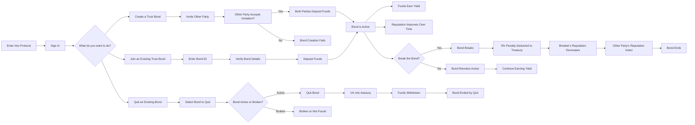
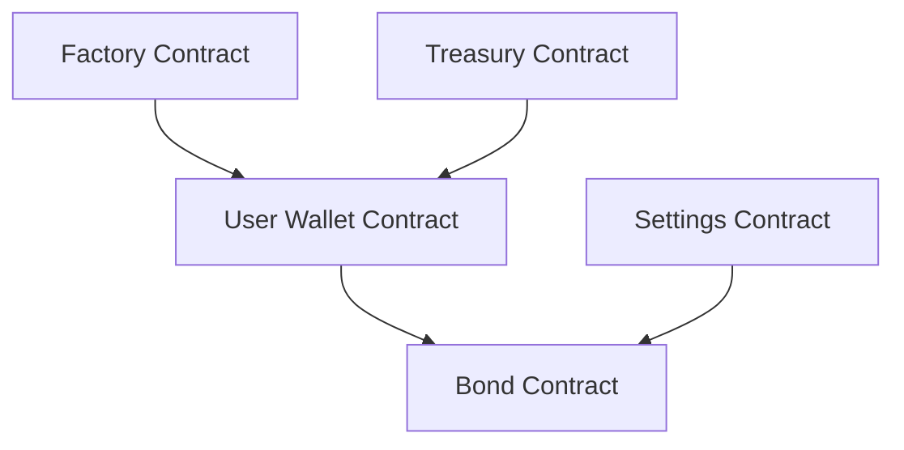

# Wade Protocol

### **Welcome to Wade Protocol**
A new way to establish on-chain credibility and reduce fraud in decentralized environments. Wade Protocol introduces on-chain trust bonds that allow users to put their money where their mouth is, proving trustworthiness while earning yield on their bond funds.

---

## **Problem Statement**
**Trust** is a fundamental component of human interaction. However, in decentralized environments, ensuring trust and credibility is challenging due to anonymity and the lack of robust verification mechanisms.

### Challenges:
- **Mistrust in Web3**: The ability to create multiple anonymous identities enables bad actors to exploit decentralized platforms through scams, rug pulls, and phishing attacks.
- **Lack of Credibility**: Honest users have no reliable way to demonstrate trustworthiness, reducing collaboration and opportunities.

---

## **Our Solution**
### **On-Chain Trust Bonds**
- Users create bonds by depositing funds into a shared or one-sided pool, signaling trust in another party.
- Bonds generate yield through lending protocols, allowing users to earn while maintaining trust.
- Breaking bonds results in financial and reputational penalties, fostering accountability.

### **New Features**
1. **Social Trust Graph**: Reputation is calculated based on trust relationships and weighted metrics.
2. **Types of Bonds**: Support for one-way and regular bonds with different weights in reputation scoring.
3. **Transitive Trust**: A trusts B, B trusts C, so A indirectly trusts C, contributing to the social trust graph.
4. **Community Reward Pool**: Yield from collected withdrawal fees, grants, and funds is distributed to honest and loyal bondholders.

---

## **Reputation Score**
Reputation lies at the core of Wade Protocol, encouraging users to behave honestly by rewarding good actions and penalizing bad ones.

### **Parameters for Reputation Calculation**:
1. **Time**: Duration for which someone maintains trust bonds without dissolving them.
2. **Amount**: Total bond money currently held by a user.
3. **Reputation**: The reputation score of users creating bonds with you (higher reputation connections carry more weight).
4. **Number**: Total number of active bonds.
5. **Type of Bond**:
   - **One-Way Bonds**: User A trusts User B and deposits money without requiring B to reciprocate.
   - **Regular Bonds**: Both users deposit money, demonstrating mutual trust. Regular bonds carry a higher weight in score calculations.
6. **Transitive Trust**: Trust connections through intermediaries enhance reputation, fostering a web of trust.

### **On-Chain Visibility**
    - Reputation points are visible and verifiable on-chain, allowing other platforms to easily query or reference these scores.
    - Protocols can then decide whether to offer users certain perks (e.g., higher borrowing limits, exclusive access) or to restrict access based on a minimum trust threshold.
### **Sybil Resistance**
    - By using unique identity checks (e.g. World ID) and identities like ENS(Ethereum naming Service), each user can build only one reputation profile, preventing people from creating multiple accounts to boost their scores artificially.

---

## **Community Reward Pool**
The Community Reward Pool incentivizes loyalty and honesty within the ecosystem.

### Sources of the Reward Pool:
1. **Withdrawal Fees**: Charged when users break bonds or dissolve them prematurely.
2. **Dissolving Fees**: Small fees charged when users take back their money by dissolving bonds.
3. **Grants and Funds**: Contributions from organizations supporting the protocol.

### Distribution:
- Yield from the pool is distributed to bondholders who:
  - Maintain bonds for longer durations.
  - Actively create trust and build the community.

---

## **How It Works**
1. **Create/Join a Bond**:
   - Deposit funds into a bond (one-way or mutual).
2. **Earn Reputation**:
   - Active bonds increase your reputation over time.
3. **Breaking Bonds**:
   - Incurs a **5% penalty** to the treasury, **reputation loss**, and an **SBT (Soulbound Token)** in your wallet marking you as a bond breaker.
4. **Build Credibility**:
   - On-chain reputation unlocks perks and trustworthiness across Web3 platforms.

---

## **Smart Contracts Architecture**

---

## **Key Benefits**
1. **For Users**:
   - Verifiable trust and reputation.
   - Passive income through bond yields.
   - Fraud deterrence through penalties and transparency.
2. **For Protocols**:
   - Automated trust layer to assess user reliability.
   - Improved security and reduced onboarding friction.
3. **For the Ecosystem**:
   - Synergistic trust framework across decentralized platforms, encouraging collaboration.

---

## **Use Cases**
- **Proof of Trustworthiness**: Show verifiable trust for perks in dApps.
- **Earn Yield**: Deposits generate passive income.
- **Interoperable Reputation**: Carry your credibility across multiple platforms.
- **Fraud Prevention**: Discourage bad actors with transparent penalties and rewards.

---

## **Join Us**
Wade Protocol is paving the way for a safer, more trustworthy decentralized future. By combining financial stakes, reputation scoring, and rewards, we aim to transform trust in Web3.

