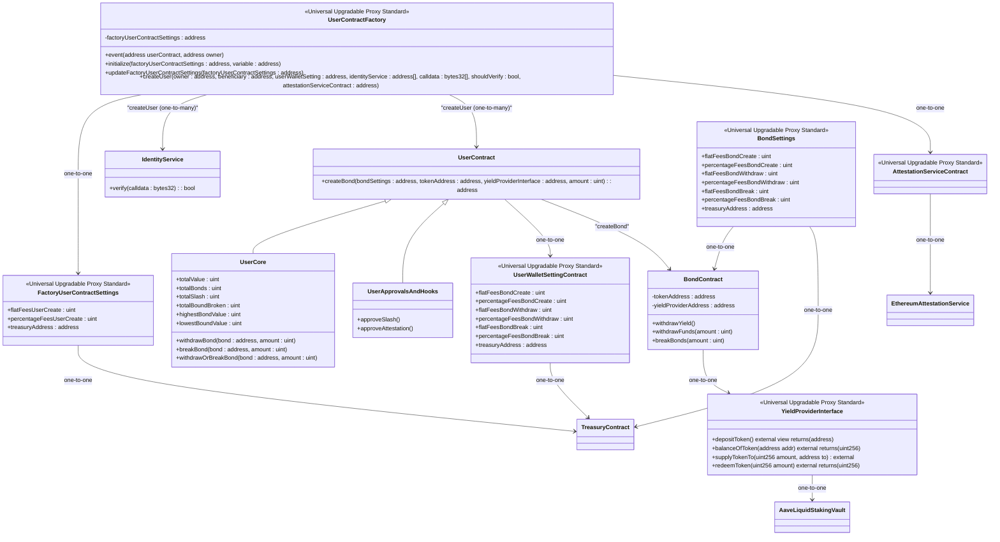

<!-- START doctoc generated TOC please keep comment here to allow auto update -->
<!-- DON'T EDIT THIS SECTION, INSTEAD RE-RUN doctoc TO UPDATE -->
**Table of Contents**  *generated with [DocToc](https://github.com/thlorenz/doctoc)*

- [Trust Protocol (An onchain trust primitive)](#trust-protocol-an-onchain-trust-primitive)
    - [**Welcome to Trust Protocol**](#welcome-to-trust-protocol)
  - [**Problem Statement**](#problem-statement)
  - [**Our Solution**](#our-solution)
    - [**On-Chain Trust Bonds**](#on-chain-trust-bonds)
    - [Challenges:](#challenges)
    - [**New Features**](#new-features)
    - [**Reputation Score**](#reputation-score)
      - [**Parameters for Reputation Calculation**:](#parameters-for-reputation-calculation)
    - [**Community Reward Pool**](#community-reward-pool)
      - [Sources of the Reward Pool:](#sources-of-the-reward-pool)
    - [Distribution:](#distribution)
  - [Architecture](#architecture)
    - [**How It Works**](#how-it-works)
    - [**Sequence Diagram**](#sequence-diagram)
    - [**Technical Architecture Overview**](#technical-architecture-overview)
    - [**Smart Contracts Architecture**](#smart-contracts-architecture)
    - [**Contracts Class Diagram**](#contracts-class-diagram)
  - [**Use Cases**](#use-cases)
  - [**Join Us**](#join-us)

<!-- END doctoc generated TOC please keep comment here to allow auto update -->

# Trust Protocol (An onchain trust primitive)

### **Welcome to Trust Protocol**
---
In the real world, trust has foundation in primitives like survival,social bonds, bloodlines etc. These trust primitives transform depending on time and place, the cavemen had a primitive of survival in order to form their trust.We might not be cavemen anymore, but humans crave connection and security, even in the digital ecosystems of today.
Hence what if there is a new way to establish on-chain trust and reduce fraud in decentralized environments. Trust Protocol introduces on-chain trust bonds that allow users to put their money where their mouth is, proving trustworthiness while earning yield on their bond funds.

## **Problem Statement**
**Trust** redefines different human interactions, be that individuals interacting on markets or party members running a state. However, in decentralized environments, ensuring trust and credibility is challenging due to anonymity, the lack of robust verification mechanisms and lack quantifiable credibility. 
Hence the positive externalities trust brings in human interactions is low or even absent on chain. That is something we wanna change.

---

## **Our Solution**
### **On-Chain Trust Bonds**
- Users create bonds by depositing funds into an escrow which gives to only 2 users, the person creating the bond and the other pair signaling trust in another user.
- The funds in the bonds generate yield through yield bearing protocols (like Aave), allowing users to not ideally lock funds while still participating in the protocol.
- A bond score is measuring on the following parameters of , value locked in bond, number of bonds, context of other users bond score, time of bond and range of a user's bond value

### Challenges:
- **Sybil in Web3**: The ability to create multiple anonymous identities enables bad actors to exploit decentralized platforms through scams, rug pulls, and phishing attacks. Sybil resistance is a huge challenge for `Trust protocol` currently.
- **Track of Credibility**: Honest users have other reliable way to demonstrate trustworthiness which may not be captured fully by the protocol, reducing collaboration and opportunities.

### **New Features**
1. **Social Trust Graph**: Reputation is calculated based on trust relationships and weighted metrics.
2. **Types of Bonds**: Support for one-way and regular bonds with different weights in reputation scoring.
3. **Transitive Trust**: A trusts B, B trusts C, so A indirectly trusts C, contributing to the social trust graph.
4. **Community Reward Pool**: Yield from collected withdrawal fees, grants, and funds is distributed to honest and loyal bondholders.

---

### **Reputation Score**
Reputation lies at the core of Trust Protocol, encouraging users to behave honestly by rewarding good actions and penalizing bad ones.

#### **Parameters for Reputation Calculation**:
1. **Time**: Duration for which someone maintains trust bonds without dissolving them.
2. **Amount**: Total bond money currently held by a user.
3. **Reputation**: The reputation score of users creating bonds with you (higher reputation connections carry more weight).
4. **Number**: Total number of active bonds.
5. **Type of Bond**:
   - **One-Way Bonds**: User A trusts User B and deposits money without requiring B to reciprocate.
   - **Regular Bonds**: Both users deposit money, demonstrating mutual trust. Regular bonds carry a higher weight in score calculations.
6. **Transitive Trust**: Trust connections through intermediaries enhance reputation, fostering a web of trust.

---

### **Community Reward Pool**
The Community Reward Pool incentivize loyalty and honesty within the ecosystem.

#### Sources of the Reward Pool:
1. **Withdrawal Fees**: Charged when users break bonds or dissolve them prematurely.
2. **Dissolving Fees**: Small fees charged when users take back their money by dissolving bonds.
3. **Grants and Funds**: Contributions from organizations supporting the protocol.

### Distribution:
- Yield from the pool is distributed to bondholders who:
  - Maintain bonds for longer durations.
  - Actively create trust and build the community.

---
## Architecture
### **How It Works**
1. **Create/Join a Bond**:
   - Deposit funds into a bond (one-way or mutual).
2. **Earn Reputation**:
   - Active bonds increase your reputation over time.
3. **Breaking Bonds**:
   - Incurs a **5% penalty** to the treasury, **reputation loss**, and an **SBT (Soulbound Token)** in your wallet marking you as a bond breaker.
4. **Build Credibility**:
   - On-chain reputation unlocks perks and trustworthiness across Web3 platforms.

### **Sequence Diagram**

### **Technical Architecture Overview**

### **Smart Contracts Architecture**

### **Contracts Class Diagram**

## **Use Cases**
- **Proof of Trustworthiness**: Show verifiable trust for perks in dApps.
- **Earn Yield**: Deposits generate passive income.
- **Interoperable Reputation**: Carry your credibility across multiple platforms.
- **Fraud Prevention**: Discourage bad actors with transparent penalties and rewards.

---

## **Join Us**

Trust Protocol is paving the way for a safer, more trustworthy decentralized future. By combining financial stakes, reputation scoring, and rewards, we aim to transform trust in Web3. TG: https://t.me/+AbV5oU_p50s2YjQ1

